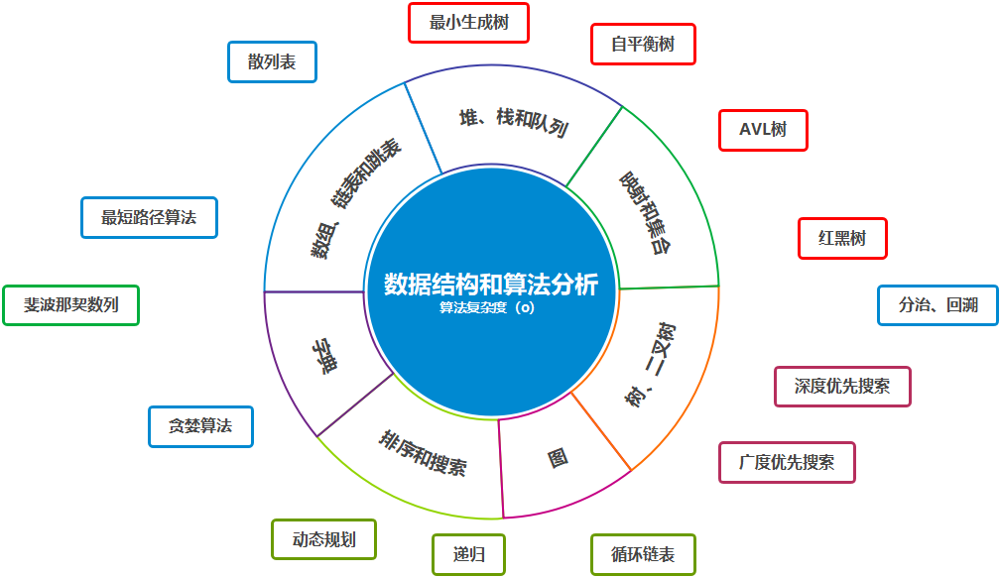

# Data Structures and Algorithm Analysis

[TOC]

## 数学基础

### 指数运算

### 对数运算

### 模运算

# 一、为什么要学习数据结构与算法？

术业有专攻。都市的高楼大厦几十层楼高，农村的房屋一般只有两三层，在农村修一栋三层楼的新房子可以找一个小包工头就可以完成，如果你想修七层甚至更高，你觉得你还会找小包工头吗？你不学习并掌握数据结构与算法同样可以找到工作，但是你只会修两三层的小楼而已。

### 树

- [搜索树]()

### 队列

- [环形队列](./queue/README.md)

### 排序

- [洗牌]()

